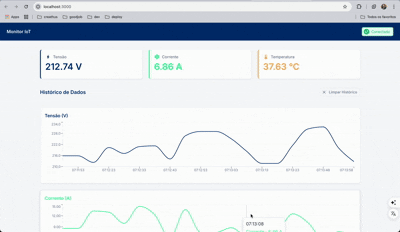

# Monitor IoT - Interface de Monitoramento

Uma aplicação web moderna para monitoramento de dados de dispositivos IoT em tempo real, desenvolvida com Next.js, TypeScript e Material-UI.



## 🚀 Características

- **Interface Responsiva**: Design moderno e responsivo com Material-UI
- **Tempo Real**: Comunicação via WebSocket para dados em tempo real
- **Gráficos Interativos**: Visualização de dados históricos com Recharts
- **Reconexão Automática**: Sistema robusto de reconexão automática
- **Notificações**: Sistema de notificações para status de conexão
- **TypeScript**: Código totalmente tipado para melhor manutenibilidade

## 📊 Dados Monitorados

- **Tensão (V)**: Medição de tensão elétrica
- **Corrente (A)**: Medição de corrente elétrica
- **Temperatura (°C)**: Medição de temperatura

## 🛠️ Tecnologias Utilizadas

- [Next.js 15](https://nextjs.org/) - Framework React
- [TypeScript](https://www.typescriptlang.org/) - Linguagem de programação
- [Material-UI v6](https://mui.com/) - Biblioteca de componentes
- [Recharts](https://recharts.org/) - Biblioteca de gráficos
- [Socket.IO Client](https://socket.io/) - Comunicação em tempo real
- [ESLint](https://eslint.org/) - Linting de código

## 🚀 Como Executar

### Pré-requisitos

- Node.js 18+
- npm ou yarn

### Instalação

1. Instale as dependências:

```bash
npm install
```

2. Configure as variáveis de ambiente:

O projeto utiliza dois arquivos de ambiente:

- **`.env.development`** - Para desenvolvimento local
- **`.env.production`** - Para produção e Docker

3. Execute em modo de desenvolvimento:

```bash
npm run dev
```

4. Acesse a aplicação em [http://localhost:3000](http://localhost:3000)

## ⚙️ Configuração

As configurações podem ser ajustadas através das variáveis de ambiente:

```env
# URL do servidor WebSocket
NEXT_PUBLIC_WEBSOCKET_URL=http://localhost:3003

# Máximo de pontos de dados históricos
NEXT_PUBLIC_MAX_DATA_POINTS=20
```

## 🏗️ Estrutura do Projeto

```
src/
├── app/                    # Páginas e layout (App Router)
├── components/             # Componentes React reutilizáveis
├── hooks/                  # Hooks customizados
├── services/               # Serviços (WebSocket, API)
├── types/                  # Definições de tipos TypeScript
└── config/                 # Configurações da aplicação
```

## 🔄 Funcionalidades WebSocket

A aplicação se conecta a um servidor WebSocket que deve fornecer:

- `modbusData`: Dados em tempo real dos sensores
- `connectionStatus`: Status da conexão Modbus

## 🎨 Interface

### Tela Principal

- **Header**: Nome da aplicação e status de conexão
- **Leituras Atuais**: Cards com valores atuais dos sensores
- **Gráficos Históricos**: Visualização temporal dos dados

### Recursos da Interface

- Indicador visual de status de conexão
- Botão de reconexão manual
- Botão para limpar histórico de dados
- Notificações de mudança de status
- Estados de loading e error

## 🔧 Desenvolvimento

### Hooks Customizados

- `useIoTDeviceData()`: Gerencia dados dos sensores
- `useConnectionStatus()`: Gerencia status de conexão
- `useHistoricalData()`: Gerencia dados históricos

### Componentes Principais

- `ConnectionStatus`: Indicador de status de conexão
- `CurrentReadings`: Cards com leituras atuais
- `Dashboard`: Gráficos históricos
- `Notification`: Sistema de notificações
